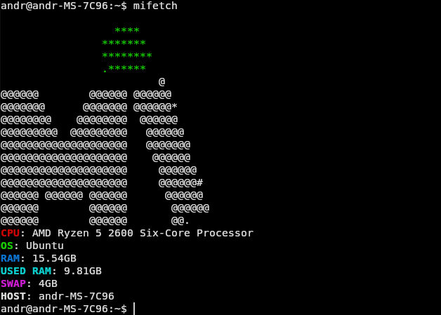

# MiFetch

> ### ⚠️ Migrated to Codeberg
>
> This project has [migrated to Codeberg](https://codeberg.org/miviolinux).

## Minimal fetch written in ~40 lines of code. Made just for fun
if you want to make custom ASCII, then you need open/create `/etc/mifetch/ascii.txt` and make ascii.
To colorize in start every line add:

`$1` - white 

`$2` - red

`$3` - green

`$4` - blue

`$5` - cyan

`$6` - yellow

`$7` - purple

to add custom colors, you can add to `colors` (in 3 line) your colors.

# Install
to install you need `cargo`:
```bash
cargo install mifetch
```
# build
```bash
git clone https://gitea.com/miviodev/mifetch.git
cd mifetch
cargo build -r
```
binary in `target/release/
